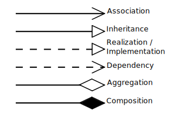
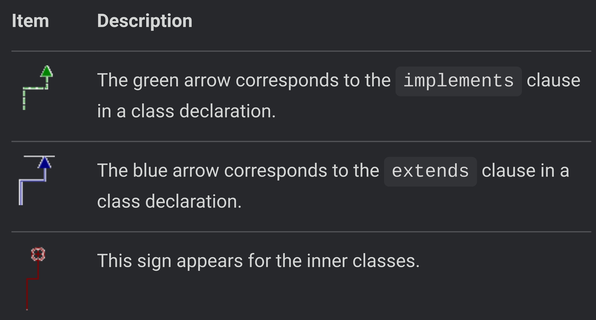

# Useful References

* [Class diagram toolbar, context menu, and legend](https://www.jetbrains.com/help/idea/class-diagram-toolbar-and-context-menu.html)
* [UML conventions](https://en.wikipedia.org/wiki/Class_diagram#Relationships)
* [UML reference card](assets/umlRefCard.pdf)

